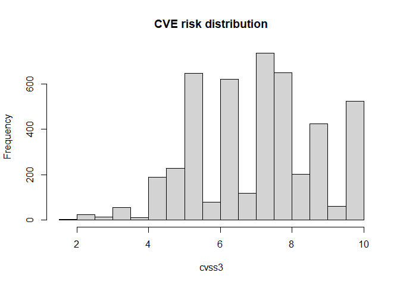

<!-- README.md is generated from README.Rmd. Please edit that file -->

# mitre

<!-- badges: start -->

[](https://www.travis-ci.com/motherhack3r/mitre)
[](https://cran.r-project.org/package=mitre)
[](https://cran.r-project.org/package=mitre)
[](https://www.rdocumentation.org/packages/mitre)
<!-- badges: end -->

mitre package is designed to provide easy access to cybersecurity data
standards. You can expect sample data frames for every standard object.
It provide a directed graph with all relationships for deep exploratory
analysis. Using scripts in data-raw folder you can build the data sets
using the latest public source files.

## Installation

You can install the released version of mitre from
[CRAN](https://CRAN.R-project.org) with:

``` r
install.packages("mitre")
```

And the development version from [GitHub](https://github.com/) with:

``` r
# install.packages("devtools")
devtools::install_github("motherhack3r/mitre")
```

## Explore cybersecurity standards

This is a basic example which shows you how to view shield tactics ids
and names:

``` r
library(mitre)
shield <- mitre::shield.tactics
shield[, c("id", "name")]
#>        id       name
#> 1 DTA0001    Channel
#> 2 DTA0002    Collect
#> 3 DTA0003    Contain
#> 4 DTA0004     Detect
#> 5 DTA0005    Disrupt
#> 6 DTA0006 Facilitate
#> 7 DTA0007 Legitimize
#> 8 DTA0008       Test
```

This example shows the distribution of vulnerability risk:

``` r
hist(mitre::cve.nist$cvss3.score, 
     main = "CVE risk distribution", xlab = "cvss3")
```



## Standards network

This code shows you the type of nodes for each standard:

``` r
mitrenet <- mitre::build_network(as_igraph = FALSE)
table(mitrenet$nodes$type, mitrenet$nodes$group)
#>                   
#>                    attck capec  car  cpe  cve  cwe shield
#>   analytic             0     0   84    0    0    0      0
#>   category             0     1    0    0    0  319      0
#>   cpe                  0     0    0 1369    0    0      0
#>   cve                  0     0    0    0 4059    0      0
#>   data_model           0     0   33    0    0    0      0
#>   group              120     0    0    0    0    0      0
#>   mitigation          42     0    0    0    0    0      0
#>   opportunity          0     0    0    0    0    0     81
#>   pattern              0   525    0    0    0    0      0
#>   procedure            0     0    0    0    0    0     65
#>   software-malware   423     0    0    0    0    0      0
#>   software-tool       70     0    0    0    0    0      0
#>   tactic              14     0    0    0    0    0      8
#>   technique          552     0    0    0    0    0     33
#>   use_case             0     0    0    0    0    0    197
#>   view                 0     0    0    0    0   28      0
#>   weakness             0     0    0    0    0  918      0
```

And the type of relationships:

``` r
table(mitrenet$edges$label)
#> 
#>            ATTACK         CanAlsoBe        CanPrecede           ChildOf 
#>               155                 3               101               497 
#>             cover            defend               has         implement 
#>               528               258               108               219 
#>           include     is_vulnerable          leverage         mitigates 
#>              4817              1984              1245              1026 
#>            PeerOf      problem_type   subtechnique-of take advantage of 
#>                10              3916               367              1178 
#>               use              uses 
#>               202              8758
```

## Code of conduct

Please note that this project is released with a [Contributor Code of
Conduct](https://pkgdown.r-lib.org/CODE_OF_CONDUCT.html). By
participating in this project you agree to abide by its terms.
