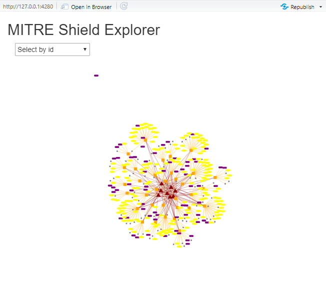
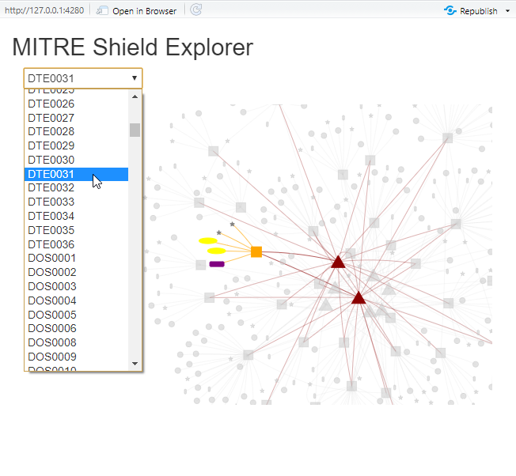

```{r, include = FALSE}
knitr::opts_chunk$set(
  collapse = TRUE,
  comment = "#>"
)
```
You can explore MITRE Shield data frames as you usually analyze data, but
the power reside in relations. Let's try to visualize the hole graph with 
a ShinyApp... let's call it: MITRExplorer.
  
  

# MITRExplorer
This is as Proof Of Concept project to provide an exploration tool for 
MITRE data sets.

Try to build your own MITRExplorer app using the following code for ui and server.

## ui.R
```{r ui_file}
# library(shiny)
# library(visNetwork)
# 
# # Define UI for application that draws a histogram
# shinyUI(fluidPage(
# 
#    # Application title
#    titlePanel("MITRE Shield Explorer"),
#    # Show a plot of the generated distribution
#    mainPanel(
#        visNetworkOutput("shieldnetwork")
#    )
# ))
```
  
  
## server.R
```{r server_file}
# library(shiny)
# library(mitre)
# library(visNetwork)
# 
# mitredata <- mitre::getLatestDataSet()
# shieldnet <- mitredata$standards$shield$shieldnet
# 
# shinyServer(function(input, output) {
# 
#    output$shieldnetwork <- renderVisNetwork({
#       ggnet <- visNetwork(nodes = shieldnet$nodes,
#                           edges = shieldnet$edges)
#       ggnet %>%
#          visOptions(highlightNearest = TRUE, nodesIdSelection = TRUE) %>%
#          visLayout(randomSeed = 123)
#    })
# })
```

## Run MITRExplorer
Open RStudio, check your working directory and run the app.
```{r runapp}
# shiny::runApp()
```

### Main explorer
The package visNetwork does the magic:



### Select objects
It's possible to interact with the network (zoom in, zoom out, drag object, etc.).
Selecting an object will pop up its description and highlight its relations.
Try it selecting one object from list or point and click.


  
### Details for DTE0031


## MITRExplorer online

[MITRExplorer](https://security.shinyapps.io/mitreshield/)
